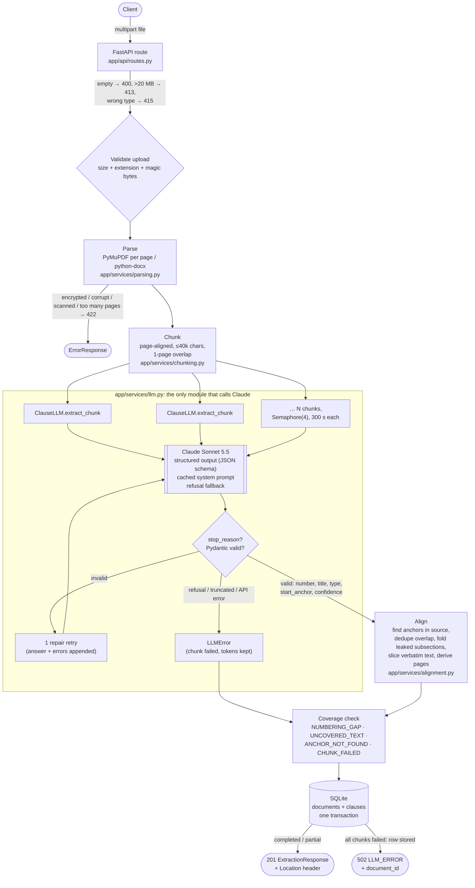
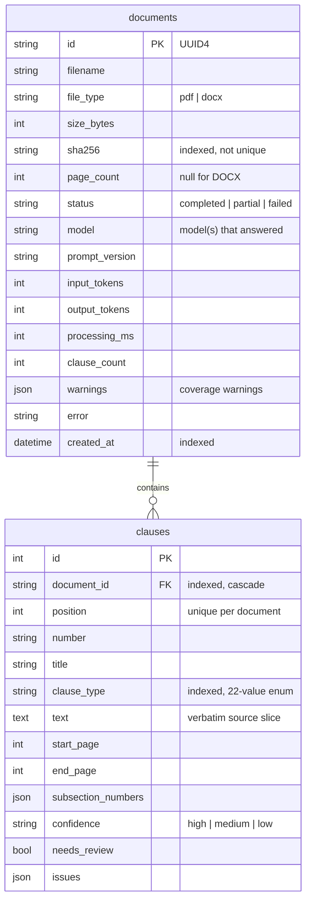

# Architecture

## Request flow: `POST /api/extract`



Read endpoints: `GET /api/extractions/{id}` and `GET /api/extractions?page&page_size&clause_type` go straight to the repository (`app/db/repository.py`).

## Data model



## Module layering

```
app/api        routes, error handlers, dependencies (HTTP only)
app/services   parsing → chunking → llm → alignment, orchestrated by extractor
app/db         SQLAlchemy models, session, repository
app/schemas    Pydantic models and enums shared by all layers
app/errors.py  AppError + ErrorCode → HTTP status (raised anywhere, rendered by app/api)
```
